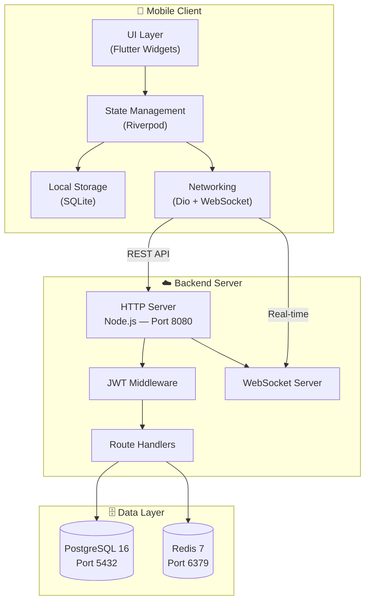
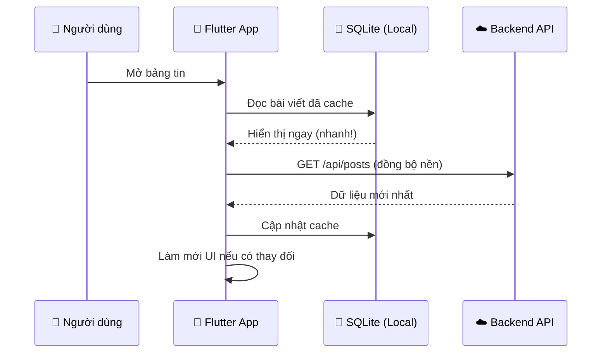

# 01 — Tổng quan DevConnect

> **Đọc file này trước tiên.** Nó giúp bạn hiểu DevConnect là gì, giải quyết vấn đề gì, và được xây dựng bằng công nghệ nào.

---

## DevConnect là gì?

DevConnect là **mạng xã hội chuyên biệt cho lập trình viên**. Khác với Facebook hay LinkedIn, DevConnect tập trung vào:

| Tính năng | Mạng xã hội thường | DevConnect |
|-----------|-------------------|------------|
| Nội dung | Ảnh, video, status | **Code snippets**, bài kỹ thuật, TIL |
| Kết nối | Bạn bè, đồng nghiệp | **Đồng đội dự án**, Mentor-Mentee |
| Việc làm | Đăng tuyển chung | **Match %** dựa trên Tech Stack |
| Gamification | Không có | **XP, Bảng xếp hạng, Danh hiệu** |

---

## Kiến trúc tổng thể

Hệ thống gồm 3 tầng chính, tất cả chạy trong Docker:



### Giải thích từng tầng

**📱 Mobile Client (Flutter)**
- **UI Layer**: Giao diện người dùng, xây bằng Flutter Widgets
- **Riverpod**: Quản lý trạng thái toàn app (state management). Khi dữ liệu thay đổi ở một nơi, tất cả các màn hình liên quan tự động cập nhật
- **SQLite**: Lưu dữ liệu offline trên thiết bị. App hoạt động được **ngay cả khi mất mạng** (Local-first strategy)
- **Dio**: Thư viện HTTP mạnh mẽ, hỗ trợ interceptor, retry, timeout

**☁️ Backend Server (Node.js)**
- Server HTTP thuần (không dùng Express) để giảm overhead và hiểu rõ nền tảng
- JWT Middleware xác thực mọi request cần đăng nhập
- WebSocket Server cho chat và thông báo real-time

**🗄️ Data Layer (Docker)**
- PostgreSQL: Cơ sở dữ liệu quan hệ chính, lưu toàn bộ dữ liệu
- Redis: Cache layer, dự kiến dùng cho session và rate limiting

---

## Chiến lược Local-first

Đây là điểm khác biệt quan trọng nhất của DevConnect. Dữ liệu **luôn đọc từ SQLite trước**, sau đó mới đồng bộ với server:



> **Tại sao Local-first?** Vì lập trình viên thường làm việc ở quán cà phê, trên tàu, hay ở những nơi mạng không ổn định. App phải luôn hoạt động mượt mà bất kể kết nối.

---

## Tech Stack

### Backend

| Công nghệ | Phiên bản | Vai trò | Lý do chọn |
|-----------|----------|---------|------------|
| Node.js | v20+ | Runtime | Event-loop phù hợp cho I/O (API + WebSocket) |
| PostgreSQL | 16 | Database | ACID, JSON support, full-text search |
| Redis | 7 | Cache | Nhanh, hỗ trợ pub/sub cho real-time |
| JWT | — | Auth | Stateless, dễ scale ngang |
| bcryptjs | — | Password | Hash an toàn (salt rounds = 10) |
| Docker | — | Deploy | Đồng nhất môi trường dev/prod |

### Frontend

| Công nghệ | Phiên bản | Vai trò | Lý do chọn |
|-----------|----------|---------|------------|
| Flutter | 3.29+ | Framework | Cross-platform, hot reload, widget library phong phú |
| Riverpod | — | State | Type-safe, testable, không cần BuildContext |
| GoRouter | — | Navigation | Declarative routing, deep linking |
| Dio | — | HTTP | Interceptors, retry, timeout |
| sqflite | — | Local DB | SQLite cho Flutter, hỗ trợ offline |

---

## Cấu trúc thư mục dự án

```
midterm-mobile/
├── app/                          # 📱 Flutter Mobile App
│   ├── lib/
│   │   ├── core/                 #   Hạ tầng dùng chung (theme, services, widgets)
│   │   ├── features/             #   Các module nghiệp vụ
│   │   │   ├── auth/             #     Đăng nhập, Đăng ký, Onboarding
│   │   │   ├── feed/             #     Bảng tin, Tạo bài viết
│   │   │   ├── explore/          #     Tìm kiếm, Khám phá
│   │   │   ├── chat/             #     Nhắn tin real-time
│   │   │   ├── notifications/    #     Thông báo
│   │   │   ├── profile/          #     Hồ sơ cá nhân
│   │   │   ├── settings/         #     Cài đặt
│   │   │   ├── projects/         #     Sàn dự án + Việc làm
│   │   │   ├── leaderboard/      #     Bảng xếp hạng
│   │   │   ├── playground/       #     Sân chơi code
│   │   │   ├── mentorship/       #     Ghép cặp Mentor
│   │   │   └── analytics/        #     Thống kê
│   │   └── data/                 #   Repositories + Models
│   └── integration_test/flows/   #   E2E Integration Tests
│
├── backend/                      # ☁️ Node.js API Server
│   ├── src/server.js             #   Entry point
│   ├── scripts/                  #   Utility scripts (test, seed)
│   ├── init.sql                  #   Database schema
│   └── Dockerfile                #   Container definition
│
├── docs/                         # 📖 Tài liệu (bạn đang ở đây)
├── docker-compose.yml            # 🐳 Orchestration
└── README.md                     # 🏠 Trang chủ dự án
```

---

## Tiếp theo

Đọc **[02_USER_FLOWS.md](02_USER_FLOWS.md)** để hiểu chi tiết từng luồng người dùng và business logic của app.
