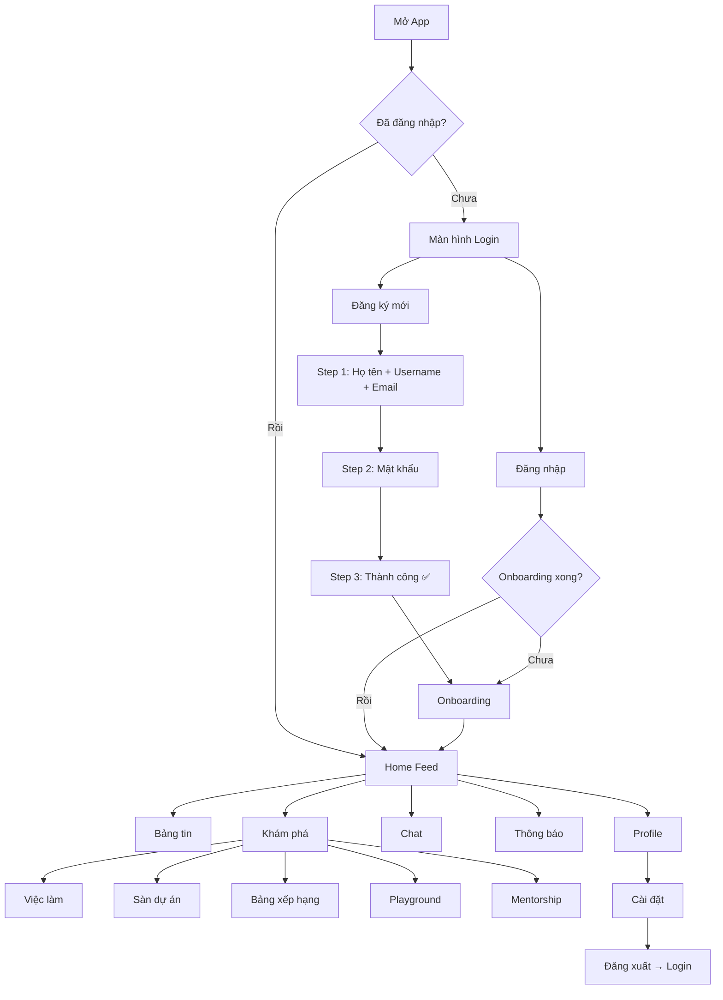
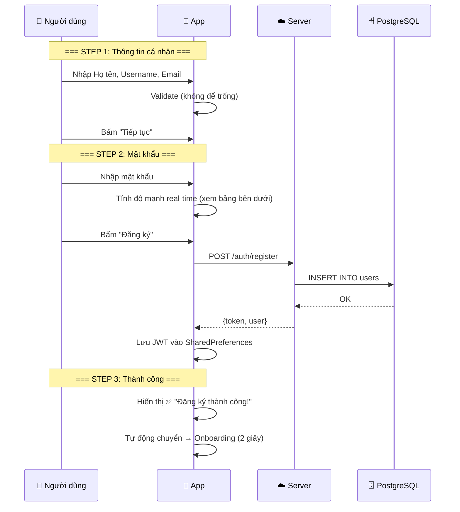
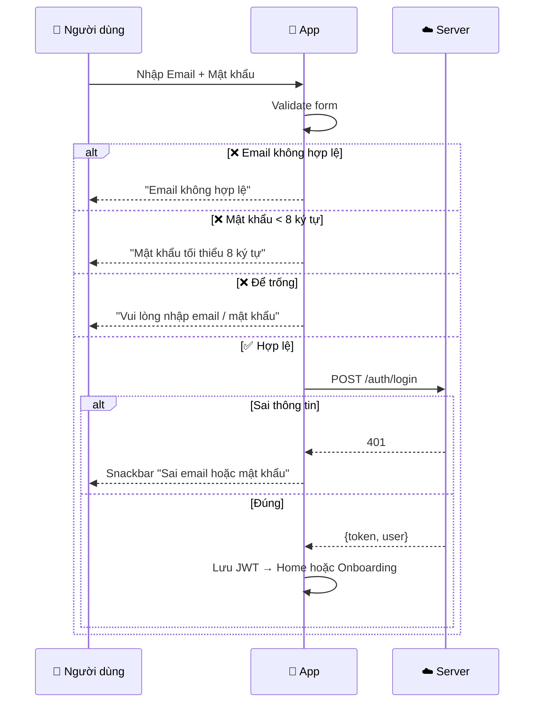
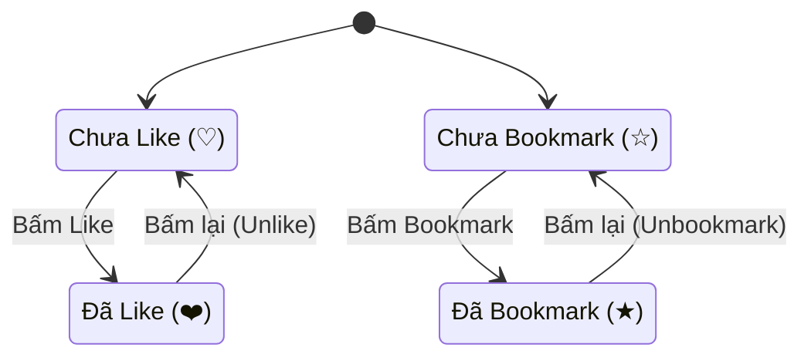
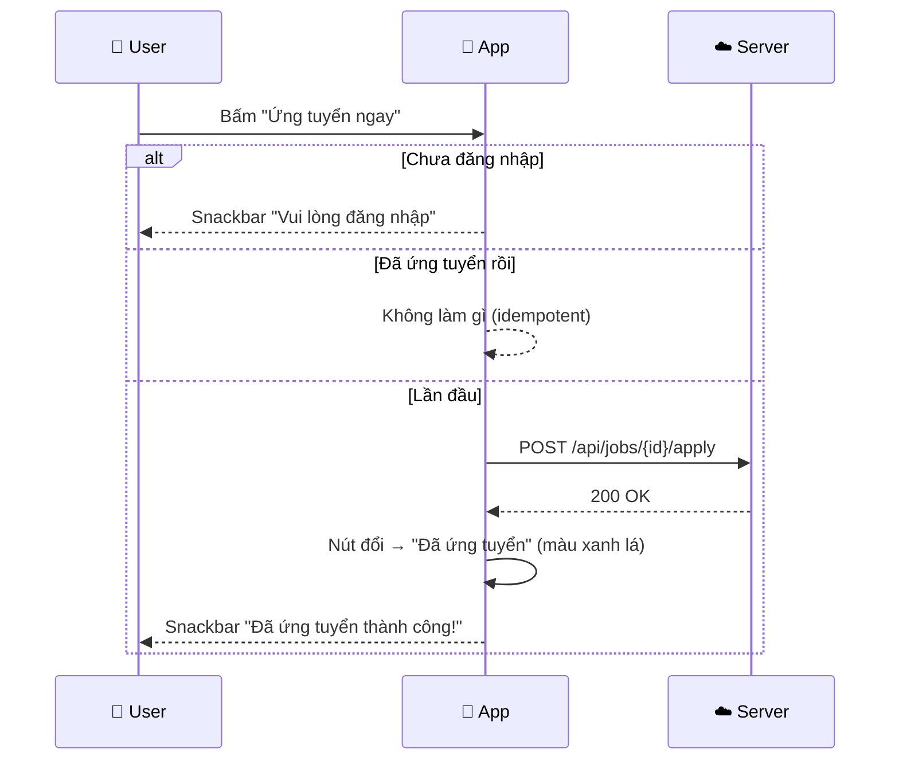
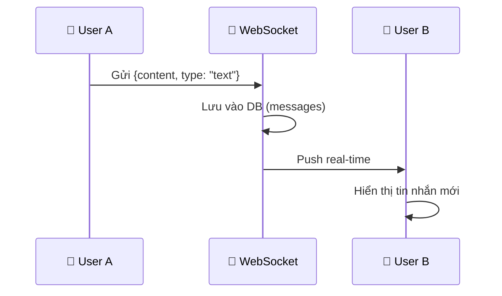

# 02 — Luồng người dùng & Business Logic

> **Đọc sau 01_OVERVIEW.** File này mô tả chi tiết **từng hành động** mà người dùng thực hiện trong app, bao gồm cả quy tắc nghiệp vụ và xử lý lỗi.

---

## Hành trình tổng thể



---

## 1. Xác thực (`auth`)

### 1.1 Đăng ký tài khoản (Multi-step Form)

Quy trình đăng ký chia **3 bước**, có thanh tiến trình ở trên cùng:



**Quy tắc độ mạnh mật khẩu:**

Mật khẩu được đánh giá theo 4 tiêu chí, mỗi tiêu chí đạt = +0.25 điểm:

| Tiêu chí | Ví dụ đạt | Điểm |
|----------|----------|------|
| Độ dài ≥ 8 ký tự | `password` | +0.25 |
| Có chữ HOA | `Password` | +0.25 |
| Có chữ số | `Password1` | +0.25 |
| Có ký tự đặc biệt `!@#$%^&*` | `Password1!` | +0.25 |

| Tổng điểm | Nhãn hiển thị | Màu thanh |
|-----------|--------------|----------|
| 0 – 0.25 | Yếu | 🔴 Đỏ |
| 0.26 – 0.50 | Trung bình | 🟡 Vàng |
| 0.51 – 0.75 | Mạnh | 🔵 Xanh dương |
| 0.76 – 1.00 | Rất mạnh | 🟢 Xanh lá |

### 1.2 Đăng nhập



### 1.3 Onboarding

Sau đăng ký lần đầu, user chọn **kỹ năng quan tâm** (Flutter, React, Go, Python…). Dữ liệu này dùng để cá nhân hóa tab "Dành cho bạn" trên Feed.

---

## 2. Bảng tin (`feed`)

### 2.1 Ba tab bảng tin

| Tab | Thuật toán | Ý nghĩa |
|-----|-----------|---------|
| **Dành cho bạn** | Hybrid Relevance | Kết hợp kỹ năng user + bài viết phổ biến → Gợi ý bài phù hợp nhất |
| **Xu hướng** | High Engagement 72h | Bài có nhiều Like + Comment nhất trong 3 ngày gần đây |
| **Đang theo dõi** | Following Filter | Chỉ hiển thị bài từ những user đã Follow |

### 2.2 Tương tác trên bài viết



> **Optimistic UI**: Icon đổi trạng thái **ngay lập tức** khi bấm, không chờ server. Nếu server trả lỗi → UI tự revert về trạng thái cũ. Điều này giúp app cảm giác cực kỳ mượt mà.

### 2.3 Tạo bài viết mới

Bấm nút FAB (+) trên Home → Điền form:

| Trường | Bắt buộc | Mô tả |
|--------|---------|-------|
| Tiêu đề | ✅ | Tên bài viết |
| Nội dung | ✅ | Hỗ trợ Markdown |
| Loại bài | ✅ | `Article` / `TIL` / `Question` |
| Tags | ❌ | Gắn nhãn chủ đề |

### 2.4 Chi tiết bài viết & Bình luận

Bấm vào bài viết → Xem chi tiết → Gửi bình luận:
- Nhập nội dung vào ô comment ở cuối màn hình
- Bấm icon Send (➤)
- Comment mới xuất hiện ngay trên danh sách
- `comment_count` trên bài viết được tăng lên

### 2.5 Pull-to-Refresh & Infinite Scroll

- **Kéo xuống** (Pull-to-refresh): Tải lại toàn bộ feed từ đầu
- **Cuộn tới cuối**: Tự động tải trang tiếp theo (Infinite scroll, 20 bài/trang)

---

## 3. Tuyển dụng (`job_board`)

### 3.1 Hiển thị Job Card

Mỗi thẻ việc làm hiển thị:

```
┌──────────────────────────────────┐
│ [G]  Google — Senior Flutter Dev │  ← Logo chữ cái đầu + Tên công ty
│                          [85%]   │  ← Match % (xanh lá)
│                                  │
│ [Flutter] [Dart] [Firebase]      │  ← Tech Stack chips
│ 📍 Hà Nội - Remote              │  ← Địa điểm + Remote
│ 💰 $3,000 - $5,000              │  ← Khoảng lương
│                                  │
│ ┌──────────────────────────────┐ │
│ │      Ứng tuyển ngay          │ │  ← Nút ứng tuyển
│ └──────────────────────────────┘ │
└──────────────────────────────────┘
```

### 3.2 Luồng ứng tuyển



**Quy tắc nghiệp vụ quan trọng:**
- Nút "Đã ứng tuyển" có `backgroundColor: success.withOpacity(0.1)` và `borderColor: success`
- Bấm lại nút "Đã ứng tuyển" → **không xảy ra gì** (idempotent, `_appliedJobs.contains(jobId)` trả `true`)
- Hỗ trợ Pull-to-refresh để cập nhật danh sách việc mới

---

## 4. Sàn dự án (`project_marketplace`)

### 4.1 Hiển thị Project Card

```
┌──────────────────────────────────┐
│ 👤 Minh Nguyen        [Tuyển]   │  ← Owner + Badge trạng thái
│ DevConnect Mobile App            │  ← Tên dự án
│ Mạng xã hội cho lập trình viên  │  ← Mô tả
│                                  │
│ [Flutter] [Node.js] [PostgreSQL] │  ← Tech Stack chips
│ 3/5 thành viên                   │  ← Tiến độ nhóm
└──────────────────────────────────┘
```

| Trạng thái | Badge | Màu |
|-----------|-------|-----|
| `LOOKING_FOR_MEMBERS` | Tuyển | 🟠 Accent |
| Khác | Hoạt động | 🔵 Primary |

- FAB "Tạo dự án" → Hiện Snackbar: *"Tạo dự án mới sẽ triển khai ở phase sau"*

---

## 5. Bảng xếp hạng (`leaderboard`)

Danh sách user sắp xếp theo `reputation` (giảm dần). Top 3 hiển thị icon đặc biệt (🥇🥈🥉).

---

## 6. Chat (`chat`)

### 6.1 Danh sách hội thoại

Hiển thị: Avatar + Tên + Tin nhắn cuối + Badge số tin chưa đọc

### 6.2 Gửi tin nhắn



**Loại tin nhắn:** `text` (văn bản) và `code` (code snippet có `code_language`)

---

## 7. Thông báo (`notifications`)

| Loại | Trigger | Nội dung |
|------|---------|---------|
| Like | Ai đó like bài của bạn | "X đã thích bài viết của bạn" |
| Follow | Ai đó follow bạn | "X đã theo dõi bạn" |
| Comment | Ai đó comment bài của bạn | "X đã bình luận bài viết của bạn" |

Nút **"Đọc hết"** → Đánh dấu tất cả `is_read = 1`

---

## 8. Profile (`profile`)

### 8.1 Cấu trúc màn hình

```
┌──────────────────────────────┐
│  [Avatar]   [Edit] [⚙️]     │
│  Minh Nguyen                 │
│  @minhdev                    │
│  Flutter developer           │
│                              │
│  ┌────────┬────────┬───────┐ │
│  │Bài viết│Theo dõi│Ng. TD │ │
│  │  12    │  156   │  89   │ │
│  └────────┴────────┴───────┘ │
│                              │
│  [Bài viết] [Đã lưu] [❤️]   │
│  ─ Danh sách nội dung ───── │
└──────────────────────────────┘
```

### 8.2 Xem Profile người khác

Bấm Avatar trên Feed/Chat/Leaderboard → Hiển thị Profile + nút **"Theo dõi"** (thay cho "Edit")

### 8.3 Follow/Unfollow

Toggle: Bấm 1 lần = Follow → Bấm lại = Unfollow. Cập nhật `follower_count` / `following_count` tức thì.

---

## 9. Cài đặt (`settings`)

| Mục | Tương tác | Loại UI |
|-----|----------|---------|
| Tài khoản | Chỉnh sửa thông tin cá nhân | Navigation |
| Giao diện | Chuyển Dark/Light mode | Switch toggle |
| Thông báo | Bật/tắt push notification | Switch toggle |
| Quyền riêng tư | Cấu hình hiển thị profile | Navigation |
| Về ứng dụng | Hiển thị phiên bản | Info page |
| Đăng xuất | Xóa JWT → Quay về Login | Button (destructive) |

---

## Tiếp theo

Đọc **[03_DATABASE.md](03_DATABASE.md)** để hiểu cấu trúc dữ liệu lưu trữ phía sau các luồng nghiệp vụ này.
