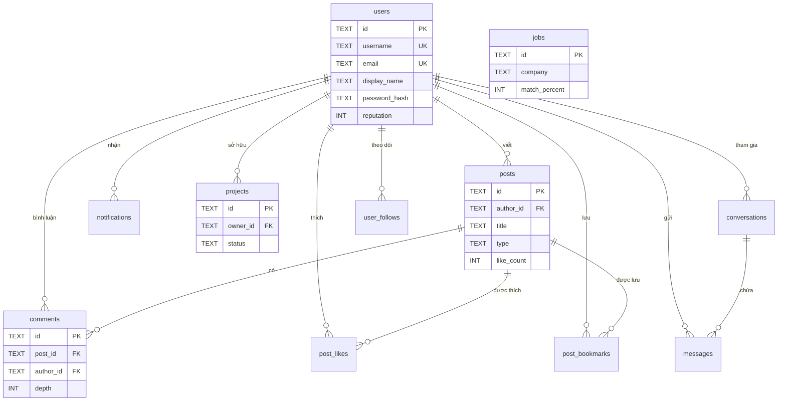
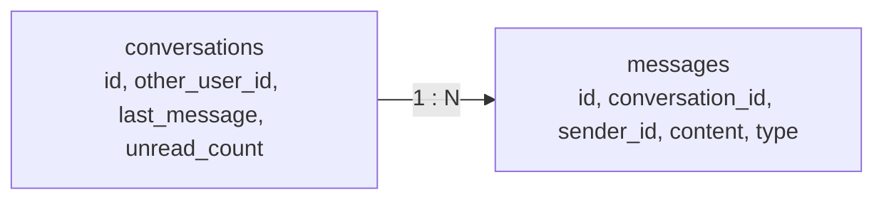

# 03 — Cơ sở dữ liệu (Database Schema)

> **Đọc sau 02_USER_FLOWS.** File này mô tả cấu trúc toàn bộ bảng dữ liệu trong PostgreSQL, mối quan hệ giữa chúng, và chiến lược đánh Index.

---

## Sơ đồ quan hệ tổng thể

> **Cách đọc biểu đồ**: Đường nối `||--o{` nghĩa là quan hệ **1-to-Many** (một user viết nhiều posts). `PK` = Primary Key, `FK` = Foreign Key, `UK` = Unique.

---

## Chi tiết từng bảng

### `users` — Người dùng

Bảng trung tâm, mọi bảng khác đều tham chiếu về đây.

| Cột | Kiểu | Constraint | Mô tả |
|-----|------|-----------|-------|
| `id` | TEXT | **PK** | ID duy nhất (UUID format) |
| `username` | TEXT | **UNIQUE**, NOT NULL | Tên đăng nhập — không ai trùng nhau |
| `display_name` | TEXT | NOT NULL | Tên hiển thị công khai |
| `email` | TEXT | **UNIQUE**, NOT NULL | Email đăng nhập — không ai trùng nhau |
| `avatar_url` | TEXT | Nullable | URL ảnh đại diện |
| `bio` | TEXT | Nullable | Tiểu sử ngắn |
| `skills` | TEXT | DEFAULT `'[]'` | Danh sách kỹ năng, lưu dạng JSON string |
| `follower_count` | INT | DEFAULT 0 | Số người theo dõi mình |
| `following_count` | INT | DEFAULT 0 | Số người mình theo dõi |
| `post_count` | INT | DEFAULT 0 | Tổng bài viết đã đăng |
| `reputation` | INT | DEFAULT 0 | Điểm XP (dùng cho Leaderboard) |
| `is_online` | INT | DEFAULT 0 | Đang online? (0 = Không, 1 = Có) |
| `is_mentor` | INT | DEFAULT 0 | Là mentor? |
| `password_hash` | TEXT | Nullable | Mật khẩu đã hash bằng bcrypt |
| `created_at` | TIMESTAMP | DEFAULT NOW | Ngày tạo tài khoản |

---

### `posts` — Bài viết

| Cột | Kiểu | Constraint | Mô tả |
|-----|------|-----------|-------|
| `id` | TEXT | **PK** | ID bài viết |
| `author_id` | TEXT | **FK** → `users.id`, ON DELETE CASCADE | Khi xóa user → xóa luôn bài |
| `title` | TEXT | NOT NULL | Tiêu đề |
| `content` | TEXT | NOT NULL | Nội dung (Markdown) |
| `type` | TEXT | DEFAULT `'article'` | Loại: `article` / `til` / `question` |
| `tags` | TEXT | DEFAULT `'[]'` | Tags, lưu JSON string |
| `image_url` | TEXT | Nullable | Ảnh minh họa |
| `view_count` | INT | DEFAULT 0 | Lượt xem |
| `like_count` | INT | DEFAULT 0 | Lượt thích |
| `comment_count` | INT | DEFAULT 0 | Số bình luận |
| `bookmark_count` | INT | DEFAULT 0 | Lượt lưu |
| `created_at` | TIMESTAMP | DEFAULT NOW | Ngày đăng |

> **`is_liked_by_me`** và **`is_bookmarked_by_me`** được tính ở tầng API (JOIN với `post_likes`/`post_bookmarks`), không lưu cố định.

---

### `comments` — Bình luận

| Cột | Kiểu | Constraint | Mô tả |
|-----|------|-----------|-------|
| `id` | TEXT | **PK** | ID bình luận |
| `post_id` | TEXT | **FK** → `posts.id`, CASCADE | Thuộc bài viết nào |
| `author_id` | TEXT | **FK** → `users.id`, CASCADE | Người bình luận |
| `content` | TEXT | NOT NULL | Nội dung comment |
| `depth` | INT | DEFAULT 0 | Độ sâu reply: 0 = top-level, 1 = reply, 2 = reply-of-reply |
| `upvotes` | INT | DEFAULT 0 | Số upvote |
| `reply_count` | INT | DEFAULT 0 | Số reply trực tiếp |
| `is_best` | INT | DEFAULT 0 | Đánh dấu "Best Answer" (cho type=question) |

---

### `jobs` — Việc làm

| Cột | Kiểu | Mô tả |
|-----|------|-------|
| `id` | TEXT PK | ID công việc |
| `company` | TEXT | Tên công ty |
| `title` | TEXT | Vị trí tuyển dụng |
| `location` | TEXT | Địa điểm |
| `remote` | INT (0/1) | Có hỗ trợ Remote không |
| `salary_range` | TEXT | Khoảng lương (VD: "$3,000 - $5,000") |
| `tech_stack` | TEXT (JSON) | Yêu cầu công nghệ |
| `experience` | TEXT | Yêu cầu kinh nghiệm |
| `match_percent` | INT | % phù hợp với user hiện tại |

---

### `projects` — Dự án

| Cột | Kiểu | Mô tả |
|-----|------|-------|
| `id` | TEXT PK | ID dự án |
| `owner_id` | TEXT FK → users | Chủ dự án |
| `title` | TEXT | Tên dự án |
| `description` | TEXT | Mô tả chi tiết |
| `tech_stack` | TEXT (JSON) | Công nghệ sử dụng |
| `status` | TEXT | `LOOKING_FOR_MEMBERS` hoặc `ACTIVE` |
| `member_count` | INT | Số thành viên hiện tại |
| `max_members` | INT (DEFAULT 5) | Số thành viên tối đa |

---

### `conversations` + `messages` — Hội thoại & Tin nhắn

**messages.type:**
| Giá trị | Mô tả |
|---------|-------|
| `text` | Tin nhắn văn bản |
| `code` | Code snippet — kèm `code_language` và `code_source` |

---

### Bảng quan hệ (Junction Tables)

Đây là các bảng trung gian dùng để biểu diễn quan hệ **Many-to-Many**:

| Bảng | Quan hệ | UNIQUE constraint | Ý nghĩa |
|------|---------|-------------------|---------|
| `user_follows` | User ↔ User | `(follower_id, following_id)` | Một user chỉ follow người khác **1 lần** |
| `post_likes` | User ↔ Post | `(post_id, user_id)` | Một user chỉ like một bài **1 lần** |
| `post_bookmarks` | User ↔ Post | `(post_id, user_id)` | Một user chỉ bookmark một bài **1 lần** |

> **Tại sao cần UNIQUE constraint?** Để đảm bảo tính **idempotent** — bấm Like 10 lần vẫn chỉ tạo 1 record.

---

## Chiến lược Index

Index giúp PostgreSQL tìm dữ liệu nhanh hơn, giống như mục lục ở cuối sách:

| Index | Bảng | Tác dụng |
|-------|------|---------|
| `idx_posts_created_at` | posts | Tăng tốc sắp xếp Feed theo thời gian mới nhất |
| `idx_posts_type` | posts | Tăng tốc lọc bài theo loại (article/til/question) |
| `idx_posts_author_id` | posts | Tăng tốc tìm tất cả bài của một user (trang Profile) |
| `idx_comments_post_id` | comments | Tăng tốc load toàn bộ comment của một bài viết |

---

## Tiếp theo

Đọc **[04_API.md](04_API.md)** để hiểu cách Frontend giao tiếp với Backend thông qua REST API.
