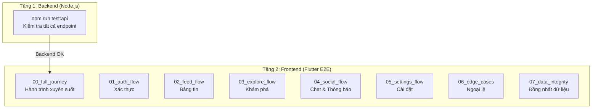
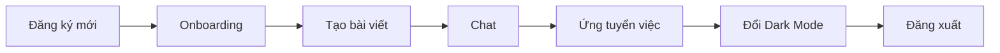
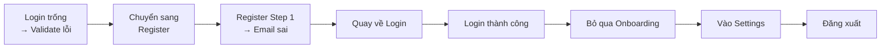
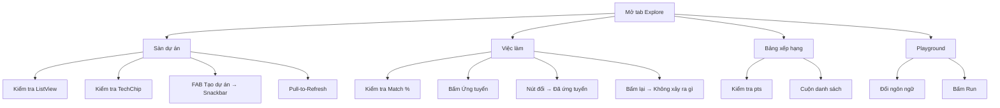

# 06 — Kiểm thử (Testing Guide)

> **Đọc sau 05_DEVELOPMENT.** File này mô tả cấu trúc bộ test E2E, cách chạy, và ý nghĩa từng luồng test.

---

## Tổng quan chiến lược test

DevConnect sử dụng **2 tầng test** độc lập:



---

## Tầng 1: Backend API Test

### Cách chạy

```powershell
cd backend
npm run test:api
```

### Kiểm tra gì?

| Endpoint | Kỳ vọng |
|----------|---------|
| `GET /health` | Status 200, `{"status":"ok"}` |
| `POST /auth/register` | Tạo user mới, trả JWT |
| `POST /auth/login` | Đăng nhập, trả JWT |
| `GET /api/posts` | Trả mảng bài viết |
| `GET /api/users` | Trả mảng users |

---

## Tầng 2: Frontend E2E Test

### Cấu trúc file

```
app/integration_test/flows/
├── 00_full_journey_test.dart      # 🏁 Hành trình tổng thể
├── 01_auth_flow_test.dart         # 🔐 Xác thực
├── 02_feed_flow_test.dart         # 📝 Bảng tin & Tương tác
├── 03_explore_flow_test.dart      # 🔍 Khám phá & Dịch vụ
├── 04_social_flow_test.dart       # 💬 Chat & Thông báo
├── 05_settings_flow_test.dart     # ⚙️ Cài đặt & Cá nhân hóa
├── 06_edge_cases_test.dart        # ⚠️ Trường hợp ngoại lệ
└── 07_data_integrity_test.dart    # 🔗 Đồng nhất dữ liệu
```

### Cách chạy

```powershell
cd app

# Chạy một luồng cụ thể:
flutter test integration_test/flows/01_auth_flow_test.dart

# Chạy toàn bộ luồng tổng thể:
flutter test integration_test/flows/00_full_journey_test.dart
```

---

## Chi tiết từng luồng test

### `00_full_journey` — Hành trình người dùng mới

Đây là luồng test **quan trọng nhất** — mô phỏng toàn bộ hành trình từ đăng ký đến đăng xuất:



**Kiểm tra gì:**
- Tạo user mới với timestamp unique
- Chọn kỹ năng trong Onboarding
- Tạo bài viết đầu tiên
- Gửi tin nhắn Chat
- Ứng tuyển việc làm
- Đổi theme sang Dark mode
- Đăng xuất và quay về Login

---

### `01_auth_flow` — Xác thực



---

### `02_feed_flow` — Bảng tin & Tương tác

**Các tương tác được test:**

| Hành động | Kiểm tra |
|----------|---------|
| Chuyển tab Feed | Dành cho bạn → Xu hướng → Đang theo dõi |
| Bấm Like ❤️ | Icon đổi từ `favorite_border` → `favorite` |
| Bấm Bookmark 🔖 | Icon đổi từ `bookmark_border` → `bookmark` |
| Xem chi tiết bài | Điều hướng vào trang detail |
| Gửi Comment | Nhập text + bấm Send |
| Pull-to-Refresh | Kéo xuống → tải lại feed |

---

### `03_explore_flow` — Khám phá chuyên sâu



---

### `04_social_flow` — Chat & Thông báo

| Bước | Hành động | Kiểm tra |
|------|----------|---------|
| 1 | Mở tab Chat | Hiển thị danh sách hội thoại |
| 2 | Mở hội thoại | Hiển thị lịch sử tin nhắn |
| 3 | Gửi tin nhắn | TextField + bấm Send |
| 4 | Mở tab Thông báo | Hiển thị danh sách |
| 5 | Bấm "Đọc hết" | Tất cả đánh dấu đã đọc |
| 6 | Xem Profile người khác | Bấm Avatar → Profile |
| 7 | Bấm Theo dõi | Toggle Follow |

---

### `05_settings_flow` — Cài đặt & Cá nhân hóa

| Bước | Hành động | Kiểm tra |
|------|----------|---------|
| 1 | Edit Profile | Đổi tên → Lưu → Tên mới xuất hiện |
| 2 | Mở Settings | Hiển thị tất cả sections |
| 3 | Toggle Dark Mode | Switch → Theme đổi |
| 4 | Toggle Thông báo | Switch hoạt động |
| 5 | Mở "Về ứng dụng" | Hiển thị phiên bản |

---

### `06_edge_cases` — Trường hợp ngoại lệ

| Test Case | Mô tả | Kỳ vọng |
|-----------|-------|---------|
| Mật khẩu yếu | Nhập `weak` | Hiện "Yếu" (đỏ) |
| Mật khẩu trung bình | Nhập `weakpassword` | Hiện "Trung bình" (vàng) |
| Mật khẩu rất mạnh | Nhập `Str0ng!Pass` | Hiện "Rất mạnh" (xanh) |
| Email sai định dạng | Nhập `not-an-email` | Hiện "Email không hợp lệ" |
| Bỏ trống mật khẩu | Submit form trống | Hiện "Vui lòng nhập mật khẩu" |

---

### `07_data_integrity` — Đồng nhất dữ liệu

| Test Case | Mô tả |
|-----------|-------|
| Đổi tên Profile | Đổi tên → Quay về Feed → Kiểm tra tên mới có xuất hiện |
| Tìm kiếm rỗng | Nhập chuỗi vô nghĩa → Kiểm tra Empty State hiển thị |

---

## Tiếp theo

Đọc **[07_ROADMAP.md](07_ROADMAP.md)** để xem kế hoạch phát triển dài hạn của dự án.
