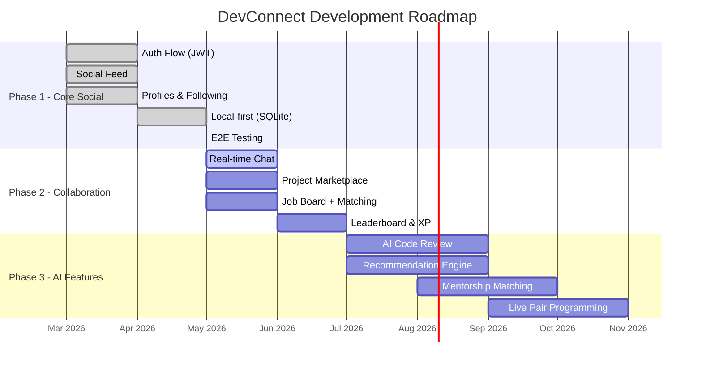

# 07 — Lộ trình phát triển (Roadmap)

> **File cuối cùng.** Mô tả kế hoạch phát triển 3 giai đoạn của DevConnect.

---

## Timeline tổng quan

---

## Phase 1: Core Social — ✅ Hoàn thành

**Mục tiêu**: MVP mạng xã hội cơ bản, chứng minh kiến trúc Local-first.

| Tính năng | Trạng thái | Chi tiết |
|-----------|-----------|---------|
| Auth Flow | ✅ | Đăng ký multi-step, Login JWT, Onboarding |
| Social Feed | ✅ | 3 tab, Infinite scroll, Pull-to-refresh |
| Profiles & Following | ✅ | Xem/Sửa profile, Follow/Unfollow |
| Like / Bookmark / Comment | ✅ | Optimistic UI, Toggle |
| Local-first (SQLite) | ✅ | Offline support, Background sync |
| E2E Integration Tests | ✅ | 8 luồng test, bao phủ toàn bộ business logic |

---

## Phase 2: Enhanced Collaboration — 🔄 Đang phát triển

**Mục tiêu**: Nâng cấp từ "xem tin" thành "cộng tác" thực sự.

| Tính năng | Trạng thái | Chi tiết |
|-----------|-----------|---------|
| Real-time Chat | 🔄 | WebSocket, hỗ trợ text + code snippet |
| Project Marketplace | 📋 | Đăng dự án, tuyển thành viên |
| Job Board | 📋 | Ứng tuyển, thuật toán Match % |
| Leaderboard & XP | 📋 | Hệ thống điểm Reputation |

---

## Phase 3: AI & Advanced — 📅 Dự kiến

**Mục tiêu**: Cá nhân hóa bằng AI, hỗ trợ học tập chuyên sâu.

| Tính năng | Chi tiết |
|-----------|---------|
| AI Code Review | Phân tích code → Gợi ý cải thiện tự động |
| Recommendation Engine | SVD Matrix Factorization cho bài viết |
| Mentorship Matching | Phân tích skill-gap → Ghép cặp mentor-mentee |
| Live Pair Programming | Phòng code cặp real-time (collaborative editor) |

---

## Nguyên tắc thiết kế

| # | Nguyên tắc | Giải thích |
|---|-----------|-----------|
| 1 | **Developer-Centric** | Dark mode mặc định, monospace cho code, UI sạch |
| 2 | **Performance First** | Optimistic UI, aggressive caching, tốc độ ưu tiên |
| 3 | **Open Architecture** | Backend API tách biệt, mở rộng Web/Desktop sau |
| 4 | **Local-first** | Dữ liệu luôn sẵn offline, đồng bộ khi có mạng |

---

## Kết thúc

Bạn đã đọc hết toàn bộ tài liệu dự án DevConnect! Quay về **[README.md](../README.md)** để xem hướng dẫn Quick Start.
